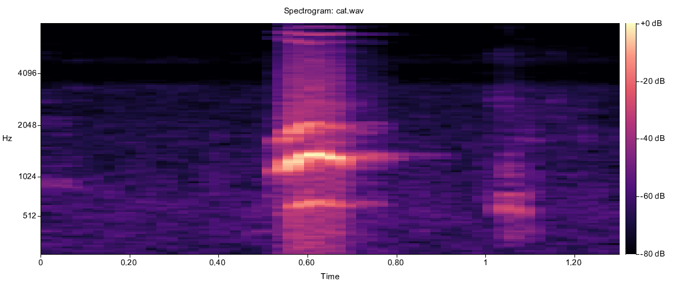
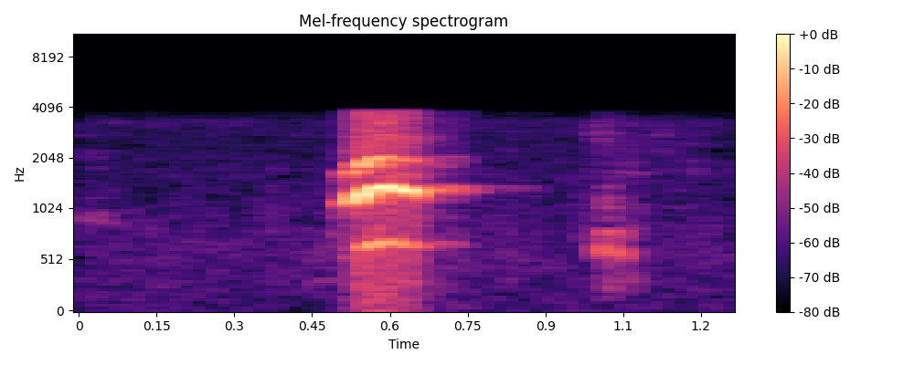

# AudioToSpectrogram

A pure Dart library for generating audio spectrograms (both mel and power) bare bones but gets the job done.

## Features

- **Audio Loading**: Reads WAV files and resamples them to a target sample rate (only wav supported for now).
- **DSP**: Computes Short-Time Fourier Transform (STFT) and Mel-frequency filterbanks.
- **Visualization**: Generates high-quality spectrogram images (heatmaps) with axes and labels.
- **Pure Dart**: Built on top of `wav`, `fftea`, and `image` without requiring native bindings.

## Visual Example

| Library Output | Librosa Output |
| :---: | :---: |
|  |  |

## Dependencies

Ensure your `pubspec.yaml` includes the necessary packages:

```yaml
dependencies:
  wav: ^1.5.0
  fftea: ^1.5.0
  image: ^4.8.0
```

## Usage

### Generating an Image

You can generate a spectrogram image directly from a WAV file:

```dart
import 'package:audio_2_spectrogram/audio_spectrogram.dart';

void main() async {
  await saveSpectrogramPng(
    'input.wav',
    'output.png',
    sampleRate: 22050,
    nFft: 2048,
    nMels: 128,
  );
}
```

### Accessing Raw Data

If you need the raw decibel values for machine learning or analysis:

```dart
final melMatrix = await melSpectrogram('input.wav');
// Returns List<Float64List> (Frames x MelBins)
```

## Running the Example

```bash
dart example/spectrogram_example.dart path/to/your/audio.wav
```
